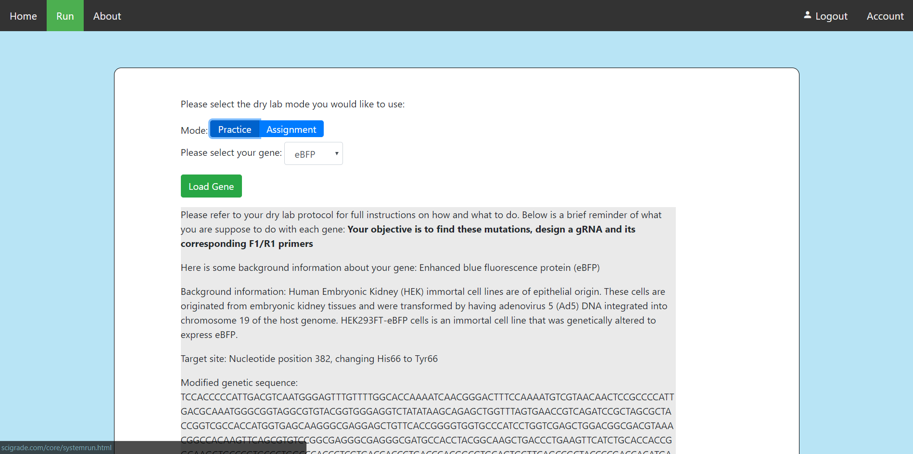
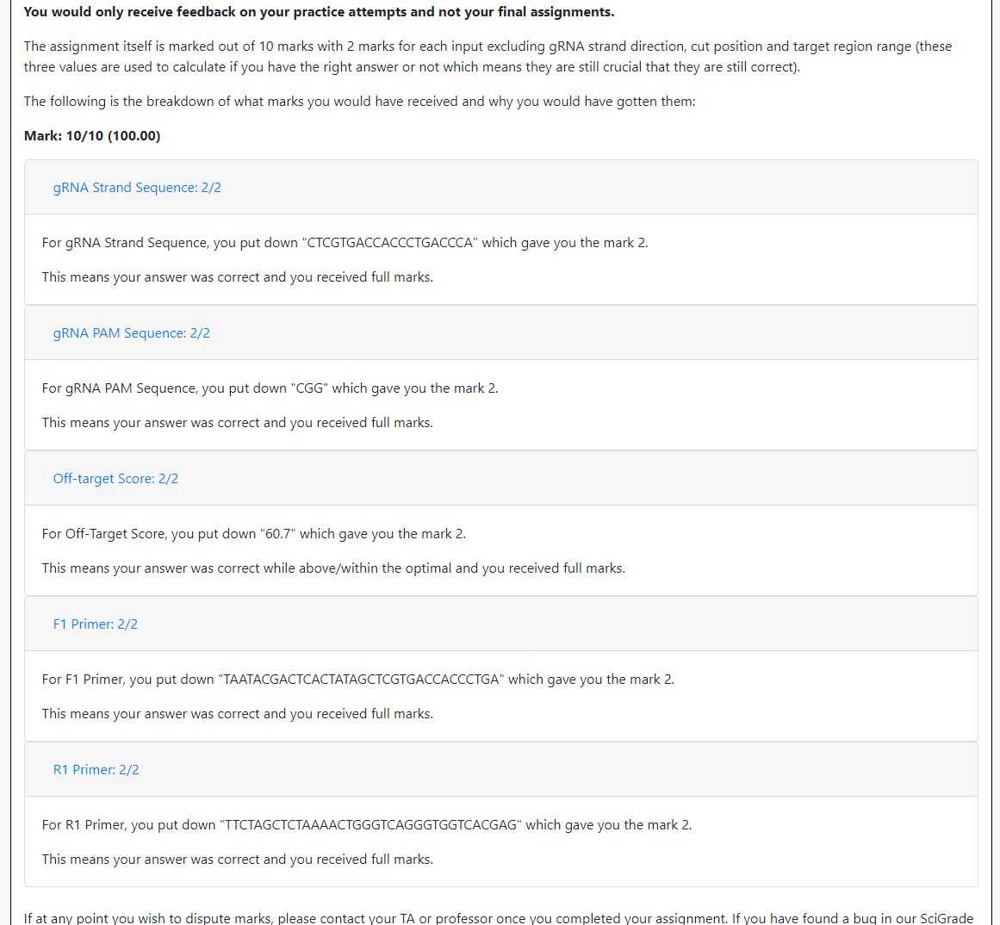
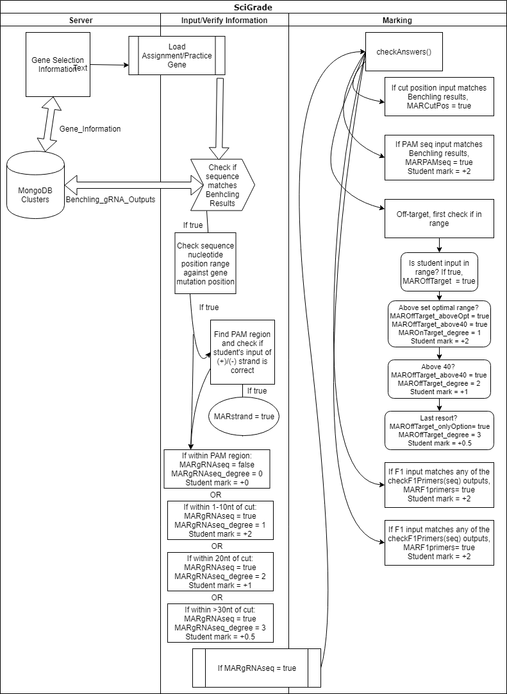

# Welcome to [SciGrade](http://scigrade.com)

If you opened this document, that means you are most likely interested in how to edit or modify SciGrade. In here, I will go over how you can change, edit and/or modify what makes SciGrade.

I recommend you read our [README](README.md) and [CONTRIBUTING](CONTRIBUTING.md) if you haven't before you start editing SciGrade.

## What’s available with SciGrade and how it works

Everything on SciGrade is generated dynamically on the client side to reduce the number of pages that are needed to be loaded.

The account management modal will be different for each person based on their account "type". There are three types:

-   Student
-   TA
-   admin

A student will only see the completed assignments section which displays to the students, which assignments they have completed that is logged on the MongoDB server.

A TA will be able to see the same as students but also the option to download student marks as well as add multiple students.

An admin will see the same as TA but also have the option to add a new TA (one by one) and adjust how the marking algorithm works.

There is also a feedback page for practice assignments screen which is displayed as an option whenever a user submits a practice assignment.

## Example protocol

There is an example protocol for students to follow in the PDF file [LabProtocol](LabProtocol.pdf). It is recommended that you customize it to your teaching class, but the protocol includes all the necessary details for students to follow to understand how to create gRNAs and where they can get the information to input into SciGrade.

## Marking algorithm

SciGrade marks the gRNA strand, PAM sequence, off-target score and the F1 and R1 primers. Using [markAnswers()](core/scripts/crispr_script.js), the student's input into the form on the practice/assignment form will be used to determine the marking.

It is important to note, the off-target scoring is dependent on the class' marking modification value. This can be changed within the account management's "Modify marking controls:" card.

Regarding the algorithm, student marks are dependent on 5 inputs:

1. gRNA sequence
2. PAM sequence
3. Off-target scoring
4. F1 primer
5. R1 primer.

The cut site is used to calculate whether the students have put in a valid gRNA sequence and its corresponding inputs. If the gRNA sequence is not found within a set range the [Benchling gRNA Output results](core/data/Benchling_gRNA_Outputs.json), then it is not a valid gRNA. If the gRNA sequence is not valid, all their answers would be wrong.

The following image describes where student's marks come from in the marking algorithm.

### Adjusting the marking algorithm

There are two ways to adjust the marking algorithm

1. Use the "Modify marking controls:" card from the account management modal. Within this modal, you can adjust how the off-target "optimal" value is calculated with two options: "Optimal" and "Custom". Optimal is calculated using the following equation: `Min_optimal = Max_range - (Max_range * 0.2)` where `Max_range` is the highest value of possible feasible off-target scores. While Custom is a custom "optimal" value which can be any number between 0.01 and 100.
2. Edit the code within [crispr_script.js](core/scripts/crispr_script.js). The following functions are related to marking: `checkAnswers()`, `checkOffTarget(score)`, `checkF1Primers(seq)` and `checkR1Primers(seq)` to determine if answers are correct or not and then `markAnswers()` to assign marks.

## Adding new genes

Currently, there is no interface that allows you to add a new gene from the front-end. Adding a new gene requires access to the MongoDB server and requires the following things:

-   Information about the gene which will be added to [Gene's Background Information](core/data/Background_info/gene_background_info.json) on the MongoDB server which includes the following information:
    -   `base_type`: "practice" or "assignment"
    -   `name`: The name of the gene
    -   `Background`: Background information of the gene
    -   `Target site`: A description of what you are targeting
    -   `Target position`: The location of what you are targeting
    -   `Sequence`: The sequence of the gene that has the target on it
    -   `NCBI gene link`: A NCBI's Gene link
-   The [gRNA outputs/answers](core/data/Benchling_gRNA_Outputs.json) which is used in the marking algorithm to assign marks which include the following information for each gene within the collection/JSON object:
    -   `Position`: Position of output
    -   `Strand`: -1 for antisense, 1 for sense
    -   `Sequence`: The gRNA sequence output
    -   `PAM`: The gRNA PAM sequence output
    -   `Specificity Score`: Off-target score
    -   `Efficiency Score`: On-target score

Add those to the appropriate data files and make sure `loadCRISPRJSON_Files()` within [crispr_scripts.js](core/scripts/crispr_script.js) is accurately calling them and SciGrade will automatically generate the rest of the front-end information (through `fillGeneList()` and `loadWork()`).

It is important to note that SciGrade's system is meant for human (Homo sapiens) GRCH38 (HG38) gene annotations using the [crispr.mit.edu from Hsu et al., 2013](http://crispr.mit.edu/) algorithm for off-target scoring.

## Thank you

Thank you for your interest in using or modifying [SciGrade](http://scigrade.com/). As mentioned in [CONTRIBUTING](CONTRIBUTING.md), we are open to any contributions at any time to SciGrade but please, when contributing, we ask you to please first discuss the change you wish to make via issue, email, or any other method with the owners of this repository before making a change.

Regarding modifications for your own use, all I ask is that you change from using our MongoDB cluster to your own. We are keeping ours encoded into the source files for an example for you to use and understand how SciGrade works.

If you have any questions or would like to get in contact with me, please feel free to Tweet me at [@AlexJSully](https://twitter.com/alexjsully).

Enjoy! :relaxed: :heart:

-[Alex](https://twitter.com/alexjsully)
