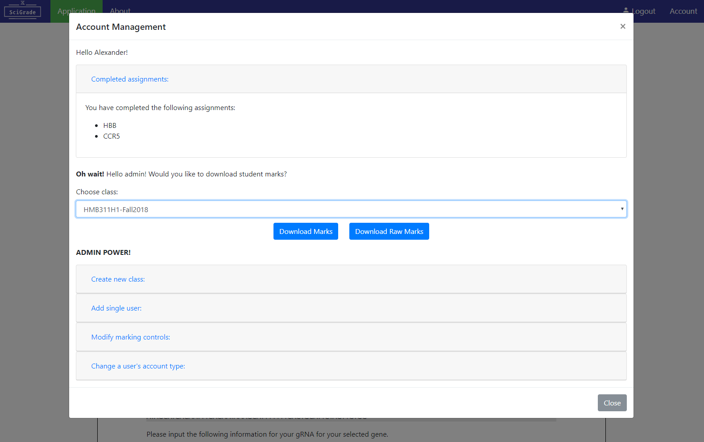
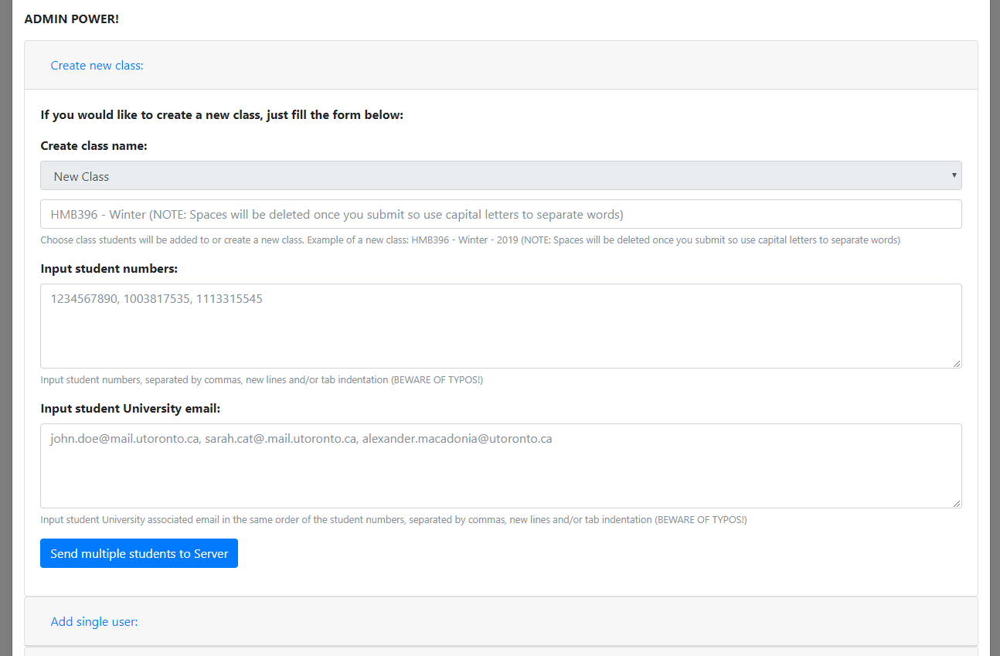
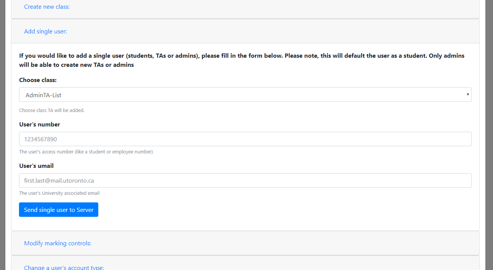
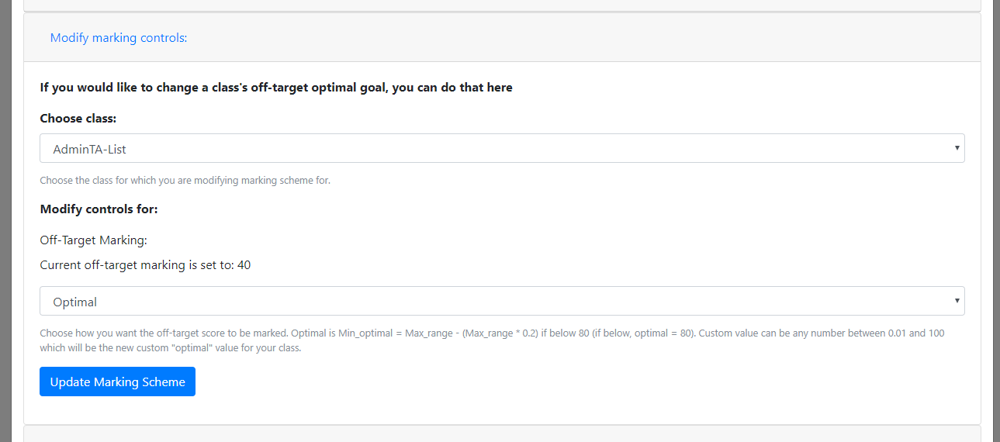
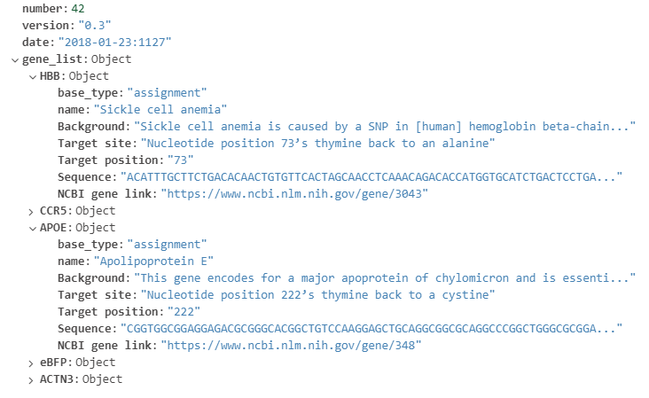

# Welcome to [SciGrade](http://scigrade.com)!

If you opened this document, that means you are most likely interested in how to edit or modify SciGrade. In here, I will go over how you can change, edit and/or modify what makes SciGrade.

I recommend you read our [README](README.md) and [CONTRIBUTING](CONTRIBUTING.md) if you haven't before you start editing SciGrade.

## What’s available with SciGrade and how it works:

Everything on SciGrade is generated dynamically on the client side to reduce the number of pages that are needed to be loaded. 

The [systemrun.html](core/systemrun.html) is the main HTML page to run SciGrade. Once the page is ready, it will initially load a "Login" or "Registration" option for the user to select. 

Both login and registration can be used for students, TAs and admins. Both require the user to have their own Google/Gmail associated email as SciGrade utilizes the [Google Identity Platform](https://developers.google.com/identity/).

Once the user has registered or logged in the page will empty its content and fill it with the content related to the assignment. This includes practice and assignment genes as well as the account management option.




The account management modal will be different for each person based on their account "type". There are three types:
* Student
* TA
* admin

A student will only see the completed assignments section which displays to the students, which assignments they have completed that is logged on the MongoDB server.

A TA will be able to see the same as students but also the option to download student marks as well as add multiple students. 

An admin will see the same as TA but also have the option to add a new TA (one by one) and adjust how the marking algorithm works.

There is also a feedback page for practice assignments screen which is displayed as an option whenever a user submits a practice assignment.


## Example protocol:

There is an example protocol for students to follow in the PDF file [LabProtocol](LabProtocol.pdf). It is recommended that you customize it to your teaching class, but the protocol includes all the necessary details for students to follow to understand how to create gRNAs and where they can get the information to input into SciGrade.

## Adding users: 

Only TAs and admins can add new students and only admins can add other admins or TAs. This is done through the account management modal. 

### Adding students: 

Multiple students at once can be added through the "Create new class:" card. Within this card, there are three input boxes. A "Choose class" option where you can add to an existing class or create a new class. It is important to note that spaces will be deleted when being added to the MongoDB server once you submit so use capital letters to separate words. To change this, just remove 
```javascript 
trueChangeValueTo = trueChangeValueTo.replace(/\s/g, ''); 
``` 
from ```changeInputClass(docCheck, checkFor, docChange, trueChangeValueTo)``` within [crispr_script.js](core/scripts/crispr_script.js)

To input multiple students, simply have each student comma, tab or newline separated. The tab and newline separation allow for importing content from Excel/CSV into the input field.

For student's numbers and emails, there must be an equal amount of each while they also must be in the same corresponding order. They are pushed to the server sequentially so anything out of order, or with a typo, will cause them to be in the wrong order on the server.



### Adding a single student:

Adding a single user must be done individually within the "Add single user:" card which can only be accessed by an admin. To change this from being admin only to allowing TAs, within the ```openAccountManagement()``` in [crispr_script.js](core/scripts/crispr_script.js), change the order of ```append_str``` or find the ```// Admin controls: ``` and combine that with the ```// TA access to add new students:```.

If you are adding a TA or admin, it recommended you add them to the "AdminTA-List" class. From there, they have to register before you can change the user into a TA or admin from the "Change a user's account type:" card. By default, users are added as students



## Marking algorithm:

SciGrade marks the gRNA strand, PAM sequence, off-target score and the F1 and R1 primers. Using [markAnswers()](core/scripts/crispr_script.js), the student's input into the form on the practice/assignment form will be used to determine the marking.

It is important to note, the off-target scoring is dependent on the class' marking modification value. This can be changed within the account management's "Modify marking controls:" card. 

Regarding the algorithm, student marks are dependent on 5 inputs: 
1. gRNA sequence
2. PAM sequence
3. Off-target scoring
4. F1 primer
5. R1 primer.

The cut site is used to calculate whether the students have put in a valid gRNA sequence and its corresponding inputs. If the gRNA sequence is not found within a set range the [Benchling gRNA Output results](core/data/Benchling_gRNA_Outputs.json), then it is not a valid gRNA. If the gRNA sequence is not valid, all their answers would be wrong.

The following image describes where student's marks come from in the marking algorithm.


### Adjusting the marking algorithm:

There are two ways to adjust the marking algorithm

1. Use the "Modify marking controls:" card from the account management modal. Within this modal, you can adjust how the off-target "optimal" value is calculated with two options: "Optimal" and "Custom". Optimal is calculated using the following equation: ```Min_optimal = Max_range - (Max_range * 0.2)``` where ```Max_range``` is the highest value of possible feasible off-target scores. While Custom is a custom "optimal" value which can be any number between 0.01 and 100.

2. Edit the code within [crispr_script.js](core/scripts/crispr_script.js). The following functions are related to marking: ```checkAnswers()```, ```checkOffTarget(score)```, ```checkF1Primers(seq)``` and ```checkR1Primers(seq)``` to determine if answers are correct or not and then ```markAnswers()``` to assign marks. 

### Changing a user's type:

If you change the MongoDB database, this will not work unless it is structured exactly like ours.

In the "Change a user's account type:" card within the Account module, you can select a user from a class and change this account type from Student or TA or admin (each with their respective properties)

## Downloading marks:

SciGrade has a built-in option to download marks as a CSV (Excel) file. There are two options:

1. Marks which includes just the percentage the student received on each assignment and raw mark out of 10
2. Raw marks which include the percentage, raw mark out of 10, and all things being marked input and what the student received on each input that contributed to their mark (gRNA sequence, PAM sequence, off-target scoring, F1 primer and R1 primer)

If you wish to change what is visible in the exported CSV file, you can modify it through the two following functions within [crispr_script.js](core/scripts/crispr_script.js):

1. ```generateRestOfIndexTable(whichIndexTable, SimpleComplex)```: Used to generate the template/header for each downloaded CSV mark's file (SimpleComplex is true for marks, false for raw marks)
2. ```generateHiddenStudentDownload(whichClass, whichType)```: Used to fill the template and download the generated CSV mark's file

## Adding new genes:

Currently, there is no interface that allows you to add a new gene from the front-end. Adding a new gene requires access to the MongoDB server and requires the following things:

* Information about the gene which will be added to [Gene's Background Information](core/data/Background_info/gene_background_info.json) on the MongoDB server which includes the following information:
   * ```base_type```: "practice" or "assignment"
   * ```name```: The name of the gene
   * ```Background```: Background information of the gene 
   * ```Target site```: A description of what you are targetting 
   * ```Target position```: The location of what you are targetting
   * ```Sequence```: The sequence of the gene that has the target on it
   * ```NCBI gene link```: A NCBI's Gene link
* The [gRNA outputs/answers](core/data/Benchling_gRNA_Outputs.json) which is used in the marking algorithm to assign marks which include the following information for each gene within the collection/JSON object:
   * ```Position```: Position of output
   * ```Strand```: -1 for antisense, 1 for sense
   * ```Sequence```: The gRNA sequence output
   * ```PAM```: The gRNA PAM sequence output
   * ```Specificity Score```: Off-target score
   * ```Efficiency Score```: On-target score

Add those to the MongoDB server and make sure ```loadCRISPRJSON_Files()``` within [crispr_scripts.js](core/scripts/crispr_script.js) is accurately calling them and SciGrade will automatically generate the rest of the front-end information (through ```fillGeneList()``` and ```loadWork()```)

## Connection to MongoDB:

The current version of SciGrade uses MongoDB Atlas as our data hosting service. If you are trying to create your own custom version of SciGrade, I recommend you to create your own MongoDB Atlas cluster ([more information on their website](https://www.mongodb.com/cloud/atlas), including [pricing](https://www.mongodb.com/cloud/atlas/pricing)).

SciGrade uses three collections to separate our information. We have one to hold our student information, one to hold information about the practice and assignment genes and one that consists of [Benchling](https://benchling.com/) [gRNA](https://benchling.com/crispr) outputs which are used to mark student's inputs. An example of what would be found in the gene information collection can be seen in the image below (or in the respective local [JSON file](core/data/Background_info/gene_background_info.json)):



Our method to connect to MongoDB is utilizing their [Stitch](https://s3.amazonaws.com/stitch-sdks/js/library/v2/stable/stitch.min.js) SDK which uses MongoDB Shell commands (view documentation [here](https://docs.mongodb.com/manual/reference/method/)). You are able to see examples of these in the HTML files (such as [index.html](index.html) and [systemrun.html](core/systemrun.html)):
```html
<script src="https://s3.amazonaws.com/stitch-sdks/js/library/v2/stable/stitch.min.js"></script>
```
Or in the javaScript files (such as [login.js](core/scripts/login.js) and [crispr_script.js](core/scripts/crispr_script.js))
```javascript
var gene_backgroundInfo;
var benchling_grna_ouputs;
/**
 * Load JSON files
 */
function loadCRISPRJSON_Files() {
  const client = new stitch.StitchClient('Your MongoDB Cluster');
  const db = client.service('mongodb', 'mongodb-atlas').db('Your MongoDB Cluster');
  // Gene background information
  client.login().then(() =>
    db.collection('Gene_Information').find({version: "0.3"}).limit(100).execute()
  ).then(docs => {
    gene_backgroundInfo = docs;
  }).catch(err => {
    console.error(err)
  });
  // Benchling gRNA outputs
  client.login().then(()=>
    db.collection('Benchling_gRNA_Outputs').find({version: "0.2"}).limit(100).execute()
  ).then(docs => {
    benchling_grna_ouputs = docs;
  }).catch(err => {
    console.error(err)
  });
}
```

## Thank you

Thank you for your interest in using or modifying [SciGrade](http://scigrade.com/). As mentioned in [CONTRIBUTING](CONTRIBUTING.md), we are open to any contributions at any time to SciGrade but please, when contributing, we ask you to please first discuss the change you wish to make via issue, email, or any other method with the owners of this repository before making a change.

Regarding modifications for your own use, all I ask is that you change from using our MongoDB cluster to your own. We are keeping ours encoded into the source files for an example for you to use and understand how SciGrade works. 

If you have any questions or would like to get in contact with me, please feel free to Tweet me at [@AlexJSully](https://twitter.com/alexjsully) or email me at alexander.j.sullivan@hotmail.com. 

Enjoy! :relaxed: :heart: 

-[Alex](https://github.com/asully)