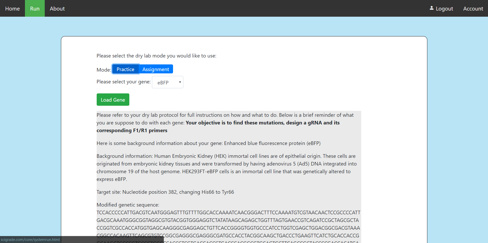
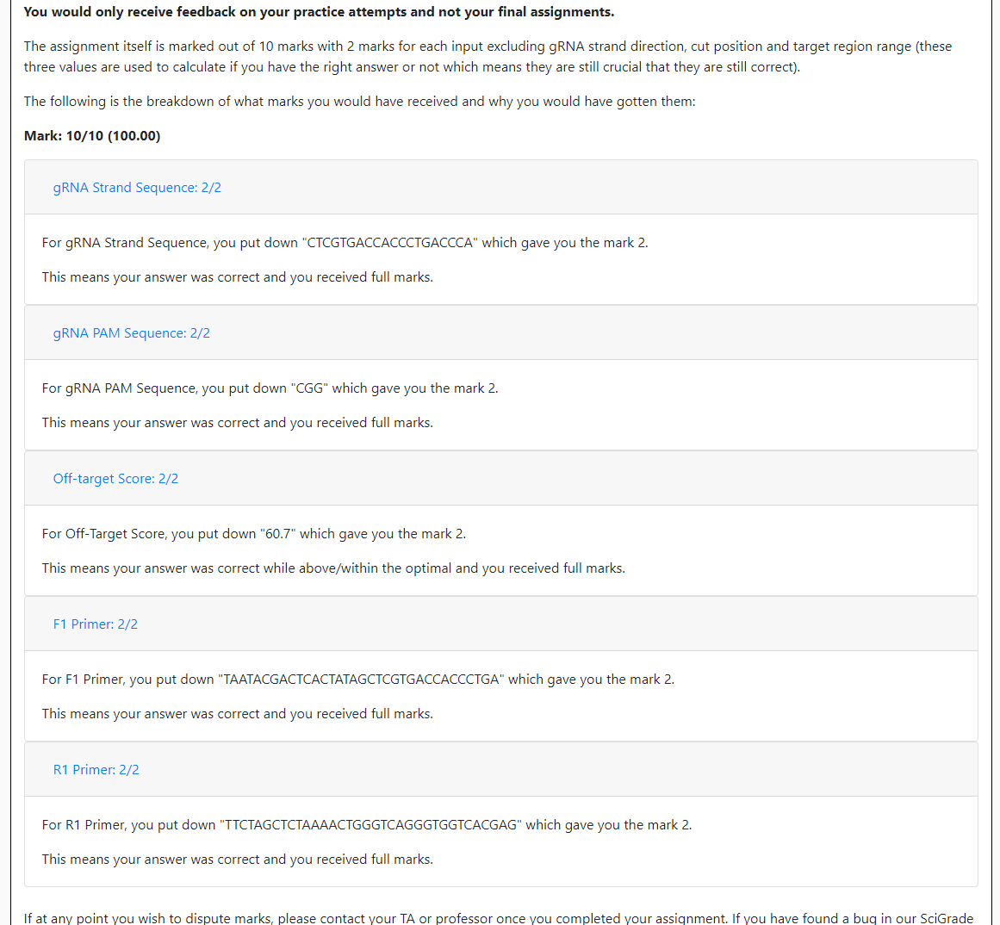
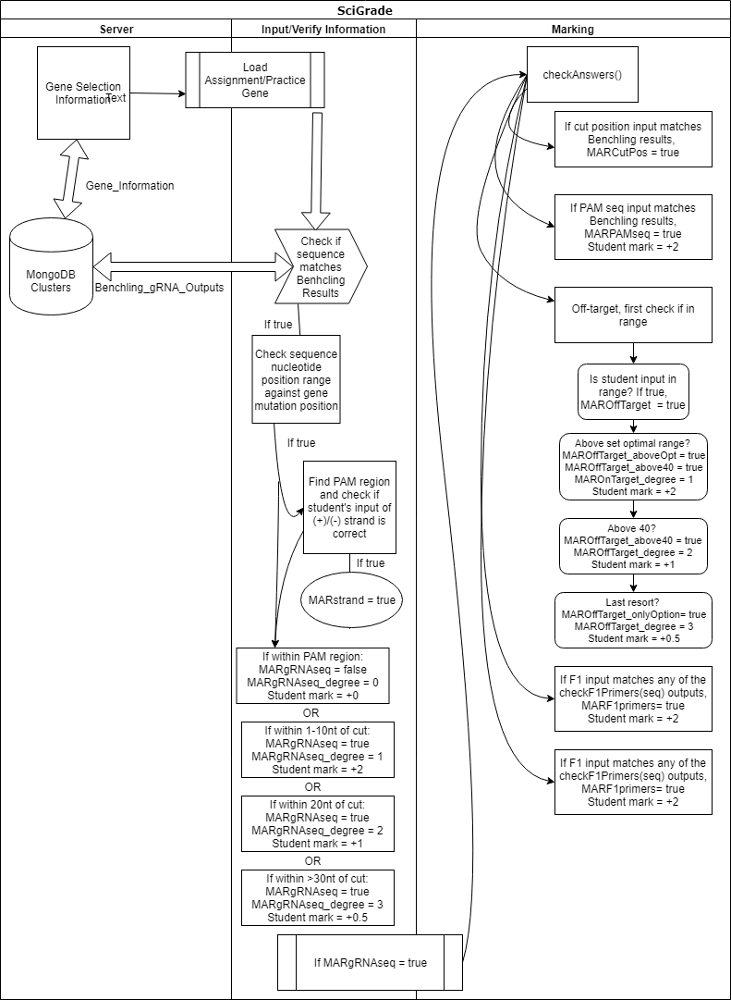

# Welcome to [SciGrade](http://scigrade.com)

If you opened this document, that means you are most likely interested in how to edit or modify SciGrade. In here, I will go over how you can change, edit and/or modify what makes SciGrade.

I recommend you read our [README](README.md) and [CONTRIBUTING](CONTRIBUTING.md) if you haven't before you start editing SciGrade.

## What’s available with SciGrade and how it works

Everything on SciGrade is generated dynamically on the client side to reduce the number of pages that are needed to be loaded.

There is also a feedback page for practice assignments screen which is displayed as an option whenever a user submits a practice assignment.

## Example protocol

There is an example protocol for students to follow in [LabProtocol.pdf](LabProtocol.pdf). It is recommended that you customize it to your teaching class, but the protocol includes details for students to follow to understand how to create guide RNAs (gRNAs) and where they can get the information to input into SciGrade.

## Marking algorithm

SciGrade validates the gRNA strand, Protospacer Adjacent Motif (PAM) sequence, off-target score, and the F1/R1 primers, and it scores gRNA sequence, PAM, off-target, and primer inputs in [markAnswers()](core/scripts/crispr_scripts.js).

The marking algorithm is fully contained in the client-side code and uses the reference data from [Benchling_gRNA_Outputs.json](core/data/Benchling_gRNA_Outputs.json) to validate answers.

Regarding the algorithm, student marks are dependent on 5 inputs:

1. gRNA sequence
2. PAM sequence
3. Off-target scoring
4. F1 primer
5. R1 primer.

The cut site is used to calculate whether the student-selected gRNA sequence includes the target position and satisfies the range checks in [core/scripts/crispr_scripts.js](core/scripts/crispr_scripts.js). If the gRNA sequence does not match a reference sequence in [core/data/Benchling_gRNA_Outputs.json](core/data/Benchling_gRNA_Outputs.json), the remaining validation steps are skipped.

The following image describes where student's marks come from in the marking algorithm.

### Adjusting the marking algorithm

Edit the code within [crispr_scripts.js](core/scripts/crispr_scripts.js). The following functions are related to marking:

- `checkAnswers()` - Validates student input against reference data
- `checkOffTarget(score)` - Validates off-target scores
- `checkF1Primers(seq)` - Validates forward primers
- `checkR1Primers(seq)` - Validates reverse primers
- `markAnswers()` - Assigns scores based on validation results

For off-target score thresholds, the optimal value is calculated using `Min_optimal = Max_range - (Max_range * 0.2)` and the threshold is set to 80 when `Min_optimal` is greater than 80 or less than 35 in [checkOffTarget()](core/scripts/crispr_scripts.js).

## Adding new genes

To add a new gene, update the JSON data files:

1. **[Gene's Background Information](core/data/Background_info/gene_background_info.json)**

    Add an entry with:
    - `base_type`: "practice" or "assignment"
    - `name`: The name of the gene
    - `Background`: Educational description
    - `Target site`: Description of what you are targeting
    - `Target position`: Numeric location of target
    - `Sequence`: Full DNA sequence containing the target
    - `NCBI gene link`: Link to NCBI gene database entry

2. **[gRNA Validation Reference](core/data/Benchling_gRNA_Outputs.json)**

    Add array of valid gRNA options with:
    - `Position`: Start position of gRNA
    - `Strand`: -1 for antisense, 1 for sense
    - `Sequence`: The 20bp gRNA sequence (5' to 3')
    - `PAM`: The 3bp PAM sequence
    - `Specificity Score`: Off-target score (0-100)
    - `Efficiency Score`: On-target cleavage efficiency

Once updated, the `loadCRISPRJSON_Files()` function in [crispr_scripts.js](core/scripts/crispr_scripts.js) will load the data, and SciGrade automatically generates the UI through `fillGeneList()` and `loadWork()`.

It is important to note that SciGrade's system is meant for human (Homo sapiens) GRCH38 (HG38) gene annotations using the [crispr.mit.edu from Hsu et al., 2013](http://crispr.mit.edu/) algorithm for off-target scoring.

## Thank you

Thank you for your interest in using or modifying [SciGrade](http://scigrade.com/). As mentioned in [CONTRIBUTING](CONTRIBUTING.md), we are open to any contributions at any time to SciGrade but please, when contributing, we ask you to first discuss the change you wish to make via issue, email, or any other method with the owners of this repository before making a change.

For complete documentation on all features, see the [docs/](docs/) directory.

If you have any questions or would like to get in contact with the maintainers, please feel free to open an issue on [GitHub](https://github.com/AlexJSully/SciGrade).

Enjoy! :relaxed: :heart:

-[Alex](https://twitter.com/alexjsully)

## Related Documentation

- [docs/index.md](docs/index.md) - Documentation entry point
- [docs/guides/marking-algorithm.md](docs/guides/marking-algorithm.md) - Marking flow details
- [docs/guides/data-structures.md](docs/guides/data-structures.md) - JSON reference data
