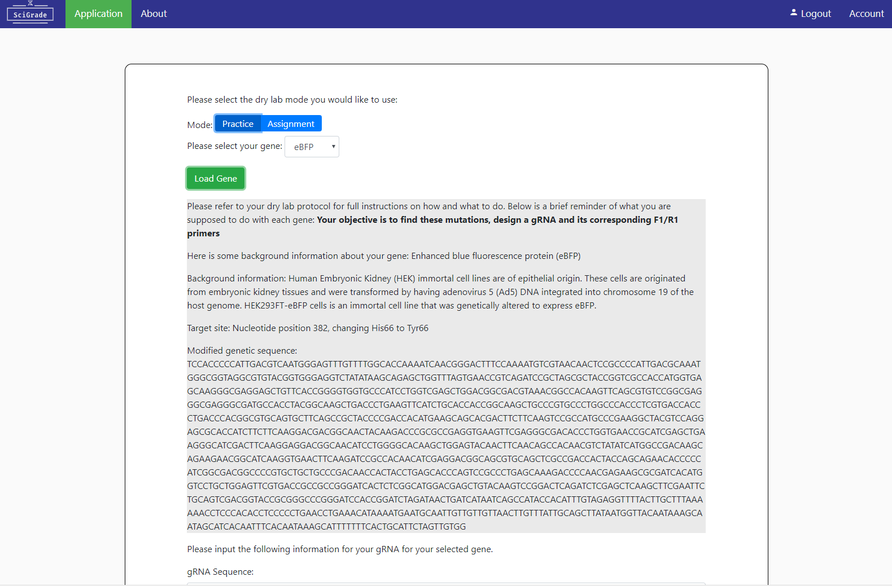

# Welcome to [SciGrade](http://scigrade.com)!

If you opened this document, that means you are most likely interested in how to edit or modify SciGrade. In here, I will go over how you can change, edit and/or modify what makes SciGrade.

I recommend you read our [README](README.md) and [CONTRIBUTING](CONTRIBUTING.md) if you haven't before you start editing SciGrade.

## Connection to MongoDB:

The current version of SciGrade uses MongoDB Atlas as our data hosting service. If you are trying to create your own custom version of SciGrade, I recommend you to create your own MongoDB Atlas cluster ([more information on their website](https://www.mongodb.com/cloud/atlas), including [pricing](https://www.mongodb.com/cloud/atlas/pricing)).

SciGrade uses three collections to seperate our information. We have one to hold our student information, one to hold information about the practice and assignment genes and one that consists of [Benchling](https://benchling.com/) [gRNA](https://benchling.com/crispr) outputs which is used to mark student's inputs. An example of what would be found in the gene information collection can be seen in the image below (or in the respective local [JSON file](core/data/Background_info/gene_background_info.json)):


Our method to connect to MongoDB is utilizing their [Stitch](https://s3.amazonaws.com/stitch-sdks/js/library/v2/stable/stitch.min.js) SDK which uses MongoDB Shell commands (view documentation [here](https://docs.mongodb.com/manual/reference/method/)). You are able to see examples of these in the HTML files (such as [index.html](index.html) and [systemrun.html](core/systemrun.html)):
```html
<script src="https://s3.amazonaws.com/stitch-sdks/js/library/v2/stable/stitch.min.js"></script>
```
Or in the javaScript files (such as [login.js](core/scripts/login.js) and [crispr_script.js](core/scripts/crispr_script.js))
```javascript
var gene_backgroundInfo;
var benchling_grna_ouputs;
/**
 * Load JSON files
 */
function loadCRISPRJSON_Files() {
  const client = new stitch.StitchClient('almark-wvohf');
  const db = client.service('mongodb', 'mongodb-atlas').db('AlMark');
  // Gene background information
  client.login().then(() =>
    db.collection('Gene_Information').find({version: "0.3"}).limit(100).execute()
  ).then(docs => {
    gene_backgroundInfo = docs;
  }).catch(err => {
    console.error(err)
  });
  // Benchling gRNA outputs
  client.login().then(()=>
    db.collection('Benchling_gRNA_Outputs').find({version: "0.2"}).limit(100).execute()
  ).then(docs => {
    benchling_grna_ouputs = docs;
  }).catch(err => {
    console.error(err)
  });
}
```

## Whats available with SciGrade and how it works:

Everything on SciGrade is generated dynamically on the client side to reduce the amount of pages that are needed to be loaded. 

The [systemrun.html](core/systemrun.html) is the main HTML page to run SciGrade. Once loaded, it will initially load a "Login" or "Registeration" option for the user to select. 

Both login and registeration can be used for stuents, TAs and admins. Both require the user to have their own Google/Gmail assoicated email as SciGrade utilizes the [Google Identity Platform](https://developers.google.com/identity/).

Once the user has registered or logged in, using [redirectCRISPR()](core/scripts/login.js), the page will empty its content and fill it with the content related to the assignment. This includes practice and assignment genes as well as the account management option.



.

The account management modal will be different for each person based on their account "type". There are three types:
* Student
* TA
* admin

A student will only see the completed assignments section which displays to the students, which assignments they have completed that is logged on the MongoDB server.

A TA will be able to see the same as students but also the option to download student marks as well as add multiple students. 

An admin will see the same as TA but also have the option to add a new TA (one by one) and adjust how the marking algoirthm works (see [markAnswers()](core/scripts/crispr_script.js) to understand how the marking algoirthm works)

There is also a feedback for practice assignments screen which is displayed as an option whenever a user submits a practice assignment.

.

## Marking algoirthm:

SciGrade marks the gRNA strand, PAM sequence, off-target score and the F1 and R1 primers. Using [markAnswers()](core/scripts/crispr_script.js), the student's input into the form on the practice/assignment form will be used to determine the marking.

It is important to note, the off-target scoring is dependent on the class' 