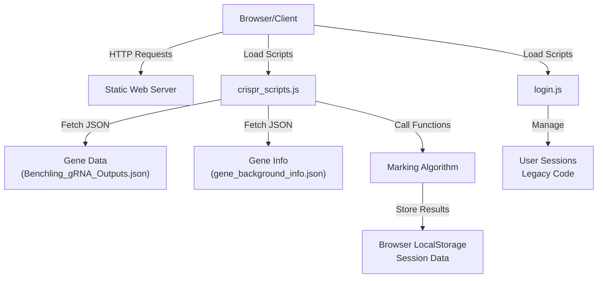
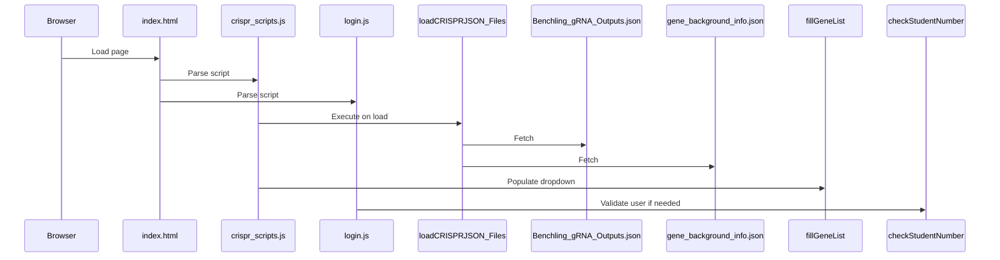
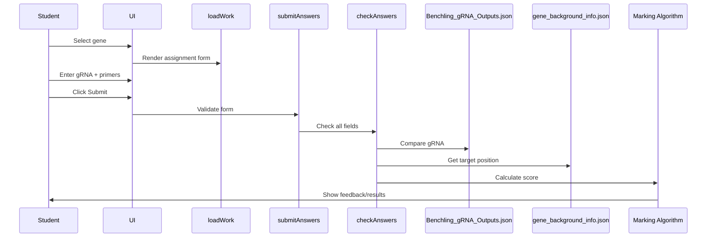
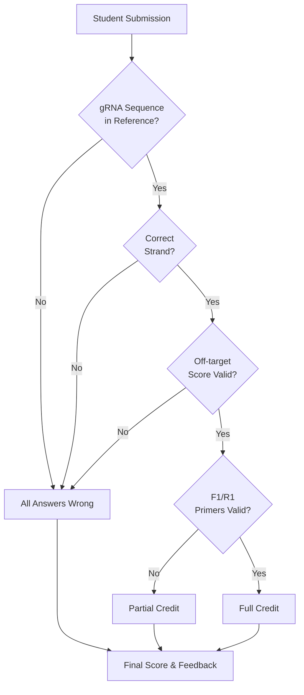
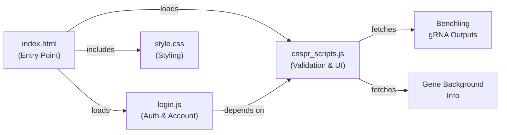

# Architecture

SciGrade is a client-side web application that dynamically renders the gRNA and primer validation interface. This section covers the system design, data flow, and component relationships.

## System Overview



## Core Components

### Frontend Scripts

#### [core/scripts/crispr_scripts.js](../../core/scripts/crispr_scripts.js)

Main application logic for gRNA and primer validation.

**Key Functions:**

- `loadCRISPRJSON_Files()` - Load gene data and benchling outputs asynchronously
- `fillGeneList()` - Populate gene selection dropdown
- `loadWork()` - Dynamically render the assignment form
- `checkAnswers()` - Validate student input against reference data
- `markAnswers()` - Calculate scores based on validation results
- `submitAnswers()` - Handle form submission

**Global State:**

- `selection_inMode` - Current mode ("practice" or "assignment")
- `current_gene` - Currently selected gene
- `gene_backgroundInfo` - Loaded gene reference data
- `benchling_gRNA_outputs` - Loaded gRNA validation reference

#### [core/scripts/login.js](../../core/scripts/login.js)

Legacy code for user management (authentication features deprecated in v1.2.0).

**Key Functions:**

- `checkStudentNumber()` - Legacy student credential validation
- `openAccountManagement()` - Legacy account modal (deprecated)
- `UpdateChooseUser()` - Legacy user switching (deprecated)

**Note:** These features are no longer used in the default configuration. See [CHANGELOG.md](../../CHANGELOG.md) for deprecation details.

### Data Files

#### [core/data/Benchling_gRNA_Outputs.json](../../core/data/Benchling_gRNA_Outputs.json)

Reference data for valid gRNA sequences and validation parameters.

Structure:

```json
{
 "gene_list": {
  "GENENAME": [
   {
    "Position": 123,
    "Strand": 1,
    "Sequence": "ACGTACGTACGTACGTACGT",
    "PAM": "NGG",
    "Specificity Score": 45.2,
    "Efficiency Score": 78.5
   }
  ]
 }
}
```

#### [core/data/Background_info/gene_background_info.json](../../core/data/Background_info/gene_background_info.json)

Educational background and metadata for each gene.

Structure:

```json
{
 "gene_list": {
  "GENENAME": {
   "base_type": "practice",
   "name": "Gene Full Name",
   "Background": "Educational description...",
   "Target site": "Nucleotide position X - target description",
   "Target position": "123",
   "Sequence": "ACGT...",
   "NCBI gene link": "https://..."
  }
 }
}
```

### Styling

#### [core/styling/style.css](../../core/styling/style.css)

Application styles covering:

- Layout and responsive design
- Form styling and validation states
- Feedback page appearance
- Modal dialogs and account management UI

Built with Bootstrap utilities integrated via [core/scripts/APIandLibraries/Bootstrap/](../../core/scripts/APIandLibraries/Bootstrap/).

### Icons & PWA Assets

[core/icon/](../../core/icon/) contains:

- `manifest.json` - PWA manifest for app installation
- Favicon files (multiple sizes)
- `browserconfig.xml` - Windows tile configuration

## Data Flow

### Initialization Flow



### Assignment Workflow



### Marking Process



## Component Relationships



## Offline Support

Service worker configuration in [workbox-config.js](../../workbox-config.js) enables:

- Offline browsing of cached pages
- Cached static assets (CSS, JS, images)
- Note: Dynamic gene data requires internet connection on first load

## Dependencies

### Frontend Libraries

Located in [core/scripts/APIandLibraries/](../../core/scripts/APIandLibraries/):

- **jQuery** - DOM manipulation and AJAX
- **Bootstrap** - CSS grid and utilities
- **tabletoCSV** - Export functionality (optional)
- **Material Icons** - Icon fonts

### Development Tools

From [package.json](../../package.json):

- **Jest** - Unit testing framework
- **Playwright** - E2E testing
- **ESLint** - Code quality
- **Prettier** - Code formatting
- **Workbox** - Service worker generation

## Security Considerations

1. **Content Security Policy** - Defined in [index.html](../../index.html) meta tags
2. **HTTPS Recommended** - Production should use HTTPS (Strict-Transport-Security header included)
3. **Input Validation** - Form inputs validated client-side and by marking algorithm

## Performance Optimizations

1. **Lazy Loading** - Gene data loaded on demand
2. **Minified Assets** - Pre-built minified versions available
3. **Service Worker Caching** - Static assets cached for offline access
4. **Client-side Rendering** - No server-side page generation overhead
