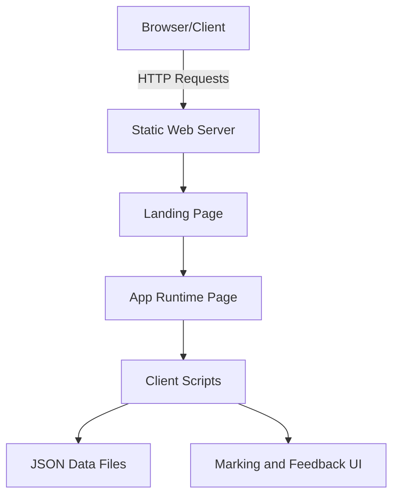
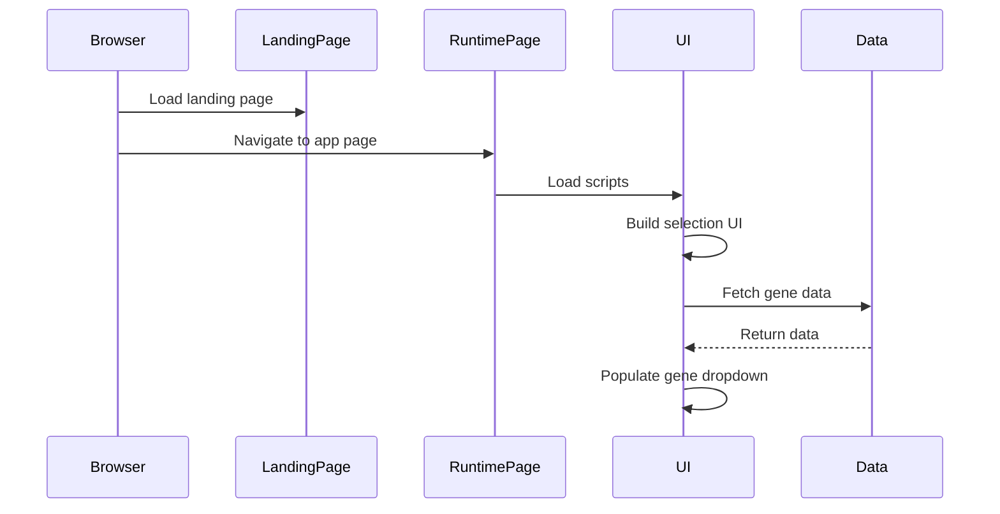
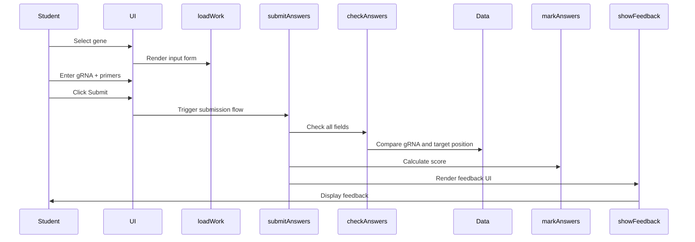
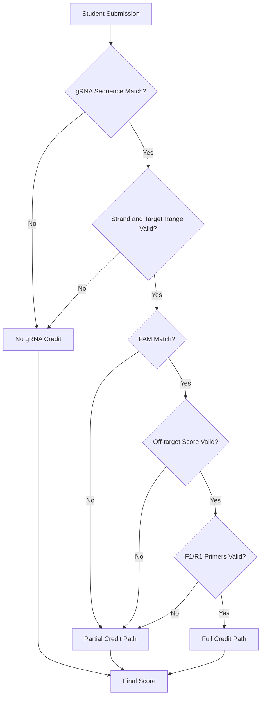
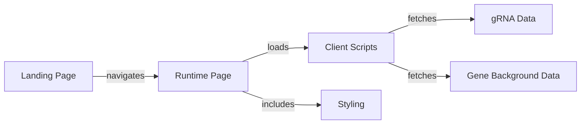

# Architecture

SciGrade is a client-side web application that dynamically renders the guide RNA (gRNA) and primer validation interface. This section covers the system design, data flow, and component relationships.

The landing page is [index.html](../../index.html), and the runtime page is [core/systemrun.html](../../core/systemrun.html). The runtime page loads the client scripts and initializes the UI flow defined in [core/scripts/runtime.js](../../core/scripts/runtime.js) and [core/scripts/crispr_scripts.js](../../core/scripts/crispr_scripts.js).

## System Overview



## Core Components

### Frontend Scripts

#### [core/scripts/crispr_scripts.js](../../core/scripts/crispr_scripts.js)

Main application logic for gRNA and primer validation.

**Key Functions:**

- `loadCRISPRJSON_Files()` - Load gene data and benchling outputs asynchronously
- `fillGeneList()` - Populate gene selection dropdown
- `loadWork()` - Dynamically render the input form
- `checkAnswers()` - Validate student input against reference data
- `markAnswers()` - Calculate scores based on validation results
- `submitAnswers()` - Handle form submission

**Global State:**

- `selection_inMode` - Current mode string (defaults to "practice")
- `current_gene` - Currently selected gene
- `gene_backgroundInfo` - Loaded gene reference data
- `benchling_gRNA_outputs` - Loaded gRNA validation reference

#### [core/scripts/runtime.js](../../core/scripts/runtime.js)

UI bootstrap helpers used by the runtime page.

**Key Functions:**

- `redirectCRISPR()` - Builds the selection UI and triggers data loading
- `loadGeneContent()` - Reads the selected gene and calls `select_Gene()`

**Note:** The runtime flow initializes the practice flow on page load in [core/systemrun.html](../../core/systemrun.html). The deprecation of online account features is recorded in [CHANGELOG.md](../../CHANGELOG.md).

### Data Files

#### [core/data/Benchling_gRNA_Outputs.json](../../core/data/Benchling_gRNA_Outputs.json)

Reference data for valid gRNA sequences and validation parameters.

Structure:

```json
{
	"gene_list": {
		"GENENAME": [
			{
				"Position": 123,
				"Strand": 1,
				"Sequence": "ACGTACGTACGTACGTACGT",
				"PAM": "NGG",
				"Specificity Score": 45.2,
				"Efficiency Score": 78.5
			}
		]
	}
}
```

#### [core/data/Background_info/gene_background_info.json](../../core/data/Background_info/gene_background_info.json)

Educational background and metadata for each gene.

Structure:

```json
{
	"gene_list": {
		"GENENAME": {
			"base_type": "practice",
			"name": "Gene Full Name",
			"Background": "Educational description...",
			"Target site": "Nucleotide position X - target description",
			"Target position": "123",
			"Sequence": "ACGT...",
			"NCBI gene link": "https://..."
		}
	}
}
```

### Styling

#### [core/styling/style.css](../../core/styling/style.css)

Application styles covering:

- Layout and responsive design
- Form styling and validation states
- Feedback page appearance
- Modal dialogs used by feedback flows

Built with Bootstrap utilities integrated via [core/scripts/APIandLibraries/Bootstrap/](../../core/scripts/APIandLibraries/Bootstrap/).

### Icons & PWA Assets

[core/icon/](../../core/icon/) contains:

- `manifest.json` - PWA manifest for app installation
- Favicon files (multiple sizes)
- `browserconfig.xml` - Windows tile configuration

## Data Flow

### Initialization Flow

The initialization flow is driven by [index.html](../../index.html), [core/systemrun.html](../../core/systemrun.html), [core/scripts/runtime.js](../../core/scripts/runtime.js), and [core/scripts/crispr_scripts.js](../../core/scripts/crispr_scripts.js).



### Submission Workflow

Submission flow is implemented in [core/scripts/crispr_scripts.js](../../core/scripts/crispr_scripts.js).



### Marking Process

Marking is driven by `checkAnswers()`, `checkOffTarget()`, and `markAnswers()` in [core/scripts/crispr_scripts.js](../../core/scripts/crispr_scripts.js).



## Component Relationships

The landing page and runtime page are defined in [index.html](../../index.html) and [core/systemrun.html](../../core/systemrun.html), with scripts in [core/scripts/crispr_scripts.js](../../core/scripts/crispr_scripts.js) and [core/scripts/runtime.js](../../core/scripts/runtime.js).



## Offline Support

Service workers are registered in [index.html](../../index.html) and [core/systemrun.html](../../core/systemrun.html). The generated worker [core/scripts/serviceWorker/sw.js](../../core/scripts/serviceWorker/sw.js) precaches the core assets listed in [workbox-config.js](../../workbox-config.js) and applies runtime caching for HTML, CSS, JavaScript, and image requests.

## Dependencies

### Frontend Libraries

Loaded by the runtime page [core/systemrun.html](../../core/systemrun.html):

- **jQuery** - Local script from [core/scripts/APIandLibraries/jQuery/](../../core/scripts/APIandLibraries/jQuery/)
- **Bootstrap** - Local script and styles from [core/scripts/APIandLibraries/Bootstrap/](../../core/scripts/APIandLibraries/Bootstrap/)
- **tabletoCSV** - Local script from [core/scripts/APIandLibraries/tabletoCSV/](../../core/scripts/APIandLibraries/tabletoCSV/)
- **Material Icons** - Google Fonts stylesheet in [core/systemrun.html](../../core/systemrun.html)

### Development Tools

From [package.json](../../package.json):

- **Jest** - Unit testing framework
- **Playwright** - E2E testing
- **ESLint** - Code quality
- **Prettier** - Code formatting
- **Workbox** - Service worker generation

## Security Considerations

1. **Content Security Policy** - Defined in meta tags in [index.html](../../index.html) and [core/systemrun.html](../../core/systemrun.html)
2. **Strict-Transport-Security** - Defined in meta tags in [index.html](../../index.html) and [core/systemrun.html](../../core/systemrun.html)
3. **Input Validation** - Form inputs are checked by the client-side marking functions in [core/scripts/crispr_scripts.js](../../core/scripts/crispr_scripts.js)

## Performance Optimizations

1. **Runtime Data Fetch** - Gene data is fetched when `redirectCRISPR()` runs in [core/scripts/runtime.js](../../core/scripts/runtime.js)
2. **Minified Assets** - Pre-built minified versions are available in [core/scripts/](../../core/scripts/) and [core/styling/](../../core/styling/)
3. **Service Worker Caching** - Runtime caching rules are defined in [workbox-config.js](../../workbox-config.js)
4. **Client-side Rendering** - UI is generated in the browser by [core/scripts/crispr_scripts.js](../../core/scripts/crispr_scripts.js)
