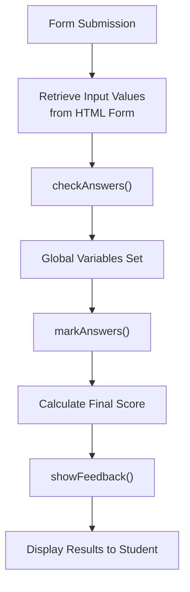

# Data Structures

This document describes the JSON data formats and data structures used throughout SciGrade.

## Overview

SciGrade uses JSON as its primary data format for gene information and guide RNA (gRNA) validation reference data. These files are loaded client-side during the runtime UI flow in [core/scripts/runtime.js](../../core/scripts/runtime.js) and [core/scripts/crispr_scripts.js](../../core/scripts/crispr_scripts.js).

## Gene Background Information

**File:** [core/data/Background_info/gene_background_info.json](../../core/data/Background_info/gene_background_info.json)

**Purpose:** Store educational metadata and background information for each gene.

### Root Structure

```json
{
	"_id": "5a67577c01ac2022a0eb6f56",
	"owner_id": "5a4cb9e58f25b9cd6d49e868",
	"number": 42,
	"version": "0.3",
	"date": "2018-08-20:1925",
	"gene_list": {}
}
```

**Metadata Fields:**

- `_id` - Legacy database identifier
- `owner_id` - Creator's user ID
- `number` - Document version number
- `version` - Semantic version of data schema
- `date` - Last updated timestamp

### Gene Entry Structure

```json
{
	"gene_list": {
		"GENENAME": {
			"base_type": "practice",
			"name": "Full Gene Name",
			"Background": "Educational description...",
			"Target site": "Nucleotide position X - description of target",
			"Target position": "123",
			"Sequence": "ACGTACGT...(full sequence)...ACGT",
			"NCBI gene link": "https://www.ncbi.nlm.nih.gov/gene/12345"
		}
	}
}
```

**Field Descriptions:**

| Field             | Type   | Description                                                       |
| ----------------- | ------ | ----------------------------------------------------------------- |
| `base_type`       | string | Either `"practice"` or `"assignment"`                             |
| `name`            | string | Full descriptive gene name                                        |
| `Background`      | string | Educational background (disease relevance, biological importance) |
| `Target site`     | string | Human-readable description of what nucleotide is being targeted   |
| `Target position` | string | Numeric position in the sequence (1-indexed)                      |
| `Sequence`        | string | Full DNA sequence containing the target (uppercase ACGT)          |
| `NCBI gene link`  | string | URL to NCBI Gene database entry (or "N/A" for synthetic genes)    |

### Example Entry

From actual data (HBB gene):

```json
{
	"HBB": {
		"base_type": "practice",
		"name": "Sickle cell anemia",
		"Background": "Sickle cell anaemia is caused by an SNP in the human haemoglobin beta-chain which results in a GAG codon being replaced with a GTG codon (A → T)...",
		"Target site": "Nucleotide position 73 - You are trying to change a thymine back to an alanine (WILD-TYPE).",
		"Target position": "73",
		"Sequence": "ACATTTGCTTCTGACACAACTGTGTTCACTAGCAACCTCAAACAGACACCATGGTGCATCTGACTCCTGAGGTGAAGTCTGCCGTTACTGCCCTGTGGGGCAAGGTGAACGTGGATGAAGTTGGTGGTGAGGCCCTGGGCAGGCTGCTGGTGGTCTACCCTTGGACCCAGAGGTTCTTTGAGTCCTTTGGGGATCTGTCCACTCCTGATGCTGTTATGGGCAACCCTAAGGTGAAGGCTCATGGCAAGAAAGTGCTCGGTGCCTTTAGTGATGGCCTGGCTCACCTGGACAACCTCAAGGGCACCTTTGCCACACTGAGTGAGCTGCACTGTGACAAGCTGCACGTGGATCCTGAGAACTTCAGGCTCCTGGGCAACGTGCTGGTCTGTGTGCTGGCCCATCACTTTGGCAAAGAATTCACCCCACCAGTGCAGGCTGCCTATCAGAAAGTGGTGGCTGGTGTGGCTAATGCCCTGGCCCACAAGTATCACTAAGCTCGCTTTCTTGCTGTCCAATTTCTATTAAAGGTTCCTTTGTTCCCTAAGTCCAACTACTAAACTGGGGGATATTATGAAGGGCCTTGAGCATCTGGATTCTGCCTAATAAAAAACATTTATTTTCATTGC",
		"NCBI gene link": "https://www.ncbi.nlm.nih.gov/gene/3043"
	}
}
```

## gRNA Benchling Outputs

**File:** [core/data/Benchling_gRNA_Outputs.json](../../core/data/Benchling_gRNA_Outputs.json)

**Purpose:** Reference data for validating student-submitted gRNA sequences and calculating off-target scores.

### Root Structure

```json
{
	"_id": "5a8deb6a547dd8319415ac3d",
	"owner_id": "5a4cb9e58f25b9cd6d49e868",
	"number": 42,
	"version": "0.2",
	"date": "2018-02-21:1657",
	"gene_list": {}
}
```

**Metadata Fields:** Timestamp and gene list reference data.

### gRNA Entry Structure

```json
{
	"gene_list": {
		"GENENAME": [
			{
				"Position": 123,
				"Strand": 1,
				"Sequence": "ACGTACGTACGTACGTACGT",
				"PAM": "NGG",
				"Specificity Score": 45.2,
				"Efficiency Score": 78.5
			}
		]
	}
}
```

**Field Descriptions:**

| Field               | Type   | Description                                                    |
| ------------------- | ------ | -------------------------------------------------------------- |
| `Position`          | number | Start position of gRNA on the template strand (1-indexed)      |
| `Strand`            | number | `1` for sense (+), `-1` for antisense (-)                      |
| `Sequence`          | string | 20bp gRNA guide sequence (5' to 3' direction)                  |
| `PAM`               | string | 3bp Protospacer Adjacent Motif (NGG for SpCas9)                |
| `Specificity Score` | number | Off-target score (0-100, higher = better specificity)          |
| `Efficiency Score`  | number | On-target cleavage efficiency (0-100, higher = more efficient) |

### Example Entries

From actual data (HBB gene):

```json
{
	"HBB": [
		{
			"Position": 14,
			"Strand": -1,
			"Sequence": "AGTGAACACAGTTGTGTCAG",
			"PAM": "AAG",
			"Specificity Score": 39.0941742,
			"Efficiency Score": 10.10900644
		},
		{
			"Position": 17,
			"Strand": -1,
			"Sequence": "GCTAGTGAACACAGTTGTGT",
			"PAM": "CAG",
			"Specificity Score": 40.4041049,
			"Efficiency Score": 22.38758304
		}
	]
}
```

### Scoring Interpretation

**Specificity Score (Off-target):**

- Used by the marking logic in [core/scripts/crispr_scripts.js](../../core/scripts/crispr_scripts.js)

**Efficiency Score (On-target):**

- Stored in the data file and not referenced by the marking logic in [core/scripts/crispr_scripts.js](../../core/scripts/crispr_scripts.js)

## Additional Data Files

### FASTA Sequence Files

**Location:** [core/data/ACTN3/](../../core/data/ACTN3/), [core/data/HBB/](../../core/data/HBB/), etc.

**Files:**

- [core/data/ACTN3/ACTN3.fasta](../../core/data/ACTN3/ACTN3.fasta) - Raw sequence in FASTA format
- [core/data/HBB/HBB.fasta](../../core/data/HBB/HBB.fasta) - Raw sequence in FASTA format
- Similar files for other genes

**Purpose:** Backup reference sequences (not actively used in current application).

**Format:** Standard FASTA format

```
>ACTN3
ACGTACGTACGTACGTACGTACGTACGTACGT
```

### Loading Implementation

In [core/scripts/crispr_scripts.js](../../core/scripts/crispr_scripts.js):

```javascript
async function loadCRISPRJSON_Files() {
	try {
		const responseBenchling = await fetch("./data/Benchling_gRNA_Outputs.json");
		benchling_gRNA_outputs = await responseBenchling.json();

		const responseGeneBackground = await fetch("data/Background_info/gene_background_info.json");
		gene_backgroundInfo = await responseGeneBackground.json();
	} catch (err) {
		console.error("Error fetching file:", err);
	}
}
```

## Student Submission Data

### Form Input Structure

From [core/scripts/crispr_scripts.js](../../core/scripts/crispr_scripts.js) `loadWork()`:

| Input Field      | HTML ID           | Type               | Max Length | Example                            |
| ---------------- | ----------------- | ------------------ | ---------- | ---------------------------------- |
| gRNA Sequence    | `sequence_input`  | text               | 20         | `CTCGTGACCACCCTGACCCA`             |
| PAM Sequence     | `pam_input`       | text               | 3          | `CGG`                              |
| Cut Position     | `position_input`  | number             | N/A        | `380`                              |
| gRNA Strand      | `strand_input`    | select             | N/A        | `"Sense (+)"` or `"Antisense (-)"` |
| Off-target Score | `offtarget_input` | number (step 0.01) | N/A        | `60.7`                             |
| F1 Primer        | `f1_input`        | text               | N/A        | `TAATACGACTCACTATAGCTCGTG...`      |
| R1 Primer        | `r1_input`        | text               | N/A        | `TTCTAGCTCTAAAACTGGGTCAG...`       |

### Submission Processing

Submission processing is implemented in [core/scripts/crispr_scripts.js](../../core/scripts/crispr_scripts.js).



## Adding New Genes

To add a new gene to SciGrade:

**Add entry to [gene_background_info.json](../../core/data/Background_info/gene_background_info.json):**

```json
{
	"NEWGENE": {
		"base_type": "practice",
		"name": "Gene Full Name",
		"Background": "Educational description...",
		"Target site": "Nucleotide position X - description",
		"Target position": "123",
		"Sequence": "ACGT... full sequence ...",
		"NCBI gene link": "https://www.ncbi.nlm.nih.gov/gene/..."
	}
}
```

**Add gRNA outputs to [Benchling_gRNA_Outputs.json](../../core/data/Benchling_gRNA_Outputs.json):**

```json
{
	"NEWGENE": [
		{
			"Position": 123,
			"Strand": 1,
			"Sequence": "ACGTACGTACGTACGTACGT",
			"PAM": "NGG",
			"Specificity Score": 45.2,
			"Efficiency Score": 78.5
		}
	]
}
```

**To Verify:**

- Gene appears in dropdown: [fillGeneList()](../../core/scripts/crispr_scripts.js#L60)
- Form loads correctly: [loadWork()](../../core/scripts/crispr_scripts.js#L82)
- Tests pass: `npm run test`

## Related Documentation

- [Marking Algorithm](marking-algorithm.md) - Validation flow and scoring
- [API Reference](../api/index.md) - Function reference for data loading
