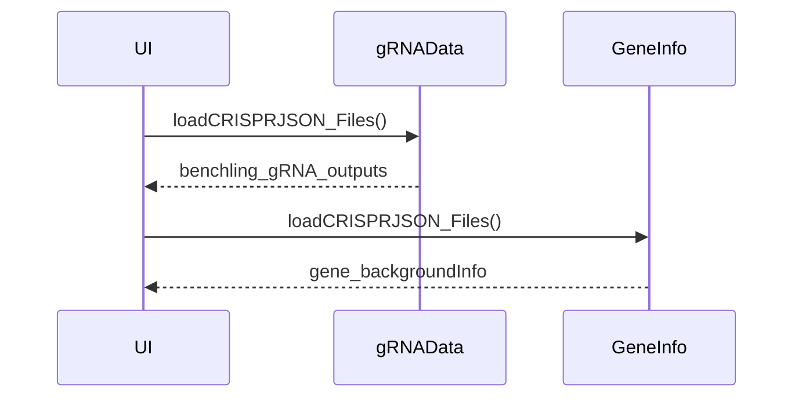
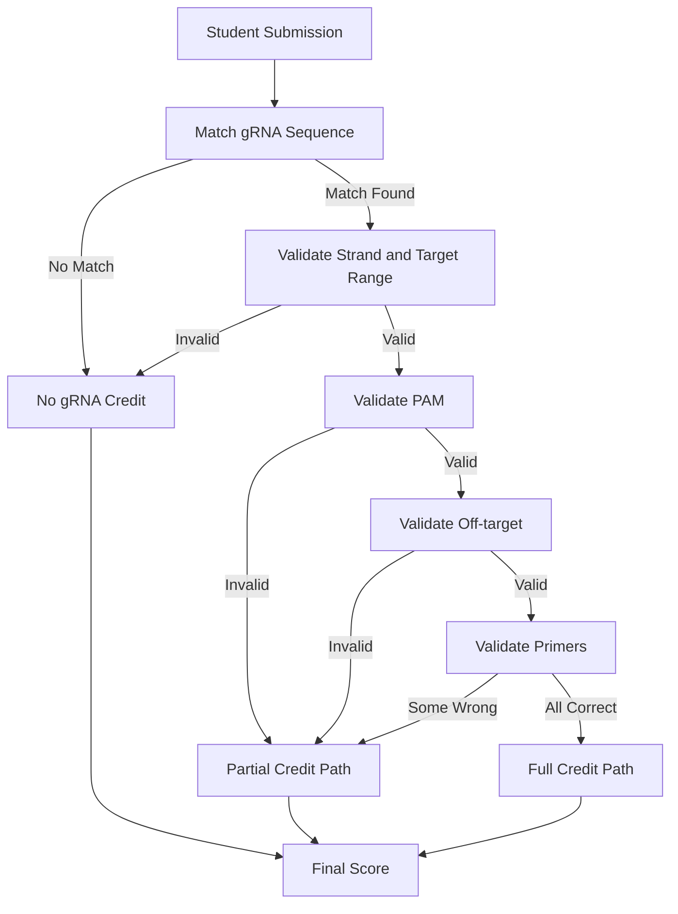
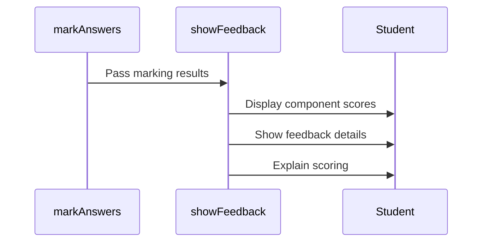

# Marking Algorithm

This document explains how guide RNA (gRNA) sequences and primers are validated and scored in SciGrade.

## Overview

The marking system validates student submissions across the components below. Scoring uses the gRNA sequence, PAM, off-target score, and primer inputs.

1. **guide RNA (gRNA) Sequence** - Must match a reference sequence
2. **Protospacer Adjacent Motif (PAM) Sequence** - Must match the PAM of the validated gRNA
3. **Strand** - Must indicate correct strand (sense/antisense)
4. **Off-target Score** - Must meet an "optimal" threshold
5. **F1 & R1 Primers** - Must be correctly designed with proper complementarity

## Core Marking Function

The main marking logic is implemented in `markAnswers()` in [core/scripts/crispr_scripts.js](../../core/scripts/crispr_scripts.js).

## Step-by-Step Validation

### Step 1: Load Reference Data



Both reference files are fetched asynchronously during initialization from [core/data/Benchling_gRNA_Outputs.json](../../core/data/Benchling_gRNA_Outputs.json) and [core/data/Background_info/gene_background_info.json](../../core/data/Background_info/gene_background_info.json) by [core/scripts/crispr_scripts.js](../../core/scripts/crispr_scripts.js).

### Step 2: gRNA Sequence Validation

When a student submits their answer, [checkAnswers()](../../core/scripts/crispr_scripts.js) searches for matching gRNA sequences:

```javascript
const inputtedSeq = document.getElementById("sequence_input").value.trim();
for (const answer of benchling_gRNA_outputs.gene_list[current_gene]) {
	if (answer.Sequence === inputtedSeq) {
		possible_comparable_answers.push(answer);
	}
}
```

**Matching Criteria:**

- Input sequence must **exactly match** one or more reference sequences (case-sensitive after trim)
- If no match found, the downstream validation steps are skipped
- If matches found, continue to step 3

### Step 3: Nucleotide Target Validation

For each possible matching sequence, verify the target nucleotide is within the gRNA binding range:

```javascript
const correctNucleotidePosition = gene_backgroundInfo.gene_list[current_gene]["Target position"] - 1;

if (possibleAnswer.Strand === 1) {
	// Sense strand: check if target is within gRNA range
	const nucleotideIncludedRange_top = possibleAnswer.Position - 1 - 1 + 3;
	const nucleotideIncludedRange_bot = possibleAnswer.Position - 1 - 17;

	if (
		correctNucleotidePosition >= nucleotideIncludedRange_bot &&
		correctNucleotidePosition <= nucleotideIncludedRange_top
	) {
		correctNucleotideIncluded = true;
	}
} else if (possibleAnswer.Strand === -1) {
	// Antisense strand: check if target is within gRNA range
	const nucleotideIncludedRange_top = possibleAnswer.Position - 1 + 17;
	const nucleotideIncludedRange_bot = possibleAnswer.Position - 1 - 3;

	if (
		correctNucleotidePosition >= nucleotideIncludedRange_bot &&
		correctNucleotidePosition <= nucleotideIncludedRange_top
	) {
		correctNucleotideIncluded = true;
	}
}
```

**Why This Matters:**

- The target position must fall within the strand-specific range calculated in [core/scripts/crispr_scripts.js](../../core/scripts/crispr_scripts.js)

### Step 4: Strand Validation

Check if the student selected the correct strand:

```javascript
if (possibleAnswer.Strand === 1) {
	if (document.getElementById("strand_input").value === "Sense (+)") {
		MARstrand = true;
	}
} else if (possibleAnswer.Strand === -1) {
	if (document.getElementById("strand_input").value === "Antisense (-)") {
		MARstrand = true;
	}
}
```

**Reference:**

- Strand `1` = Sense (+) strand
- Strand `-1` = Antisense (-) strand

### Step 5: PAM Sequence Validation

PAM validation compares the student's input to the `PAM` value on the matched reference entry in [core/data/Benchling_gRNA_Outputs.json](../../core/data/Benchling_gRNA_Outputs.json) as implemented in [core/scripts/crispr_scripts.js](../../core/scripts/crispr_scripts.js).

### Step 6: Off-Target Score Validation

```javascript
function checkOffTarget(score) {
	// Check if off-target score meets minimum threshold
}
```

**Scoring Modes:**

The off-target score uses the following steps in [core/scripts/crispr_scripts.js](../../core/scripts/crispr_scripts.js):

1. Build a list of reference scores within +/- 35 positions of the submitted cut position.
2. Compute `Max_range` from that list and `Min_optimal = Max_range - (Max_range * 0.2)`.
3. Use 80 as the threshold if `Min_optimal` is greater than 80 or less than 35.

**Pass Criteria:**

- Input at or above the optimal threshold sets `MAROffTarget_degree` to `1`.
- Input at or above 35 sets `MAROffTarget_degree` to `1` when the local max score is below 80, otherwise it sets `MAROffTarget_degree` to `2`.
- If the local max score is below 35, the input is treated as the only option and sets `MAROffTarget_degree` to `3`.

### Step 7: Primer Validation

#### F1 Primer Check

The F1 primer is validated by building candidate primers with the `TAATACGACTCACTATAG` prefix and the first 16-20 bases of the submitted gRNA sequence in [core/scripts/crispr_scripts.js](../../core/scripts/crispr_scripts.js).

#### R1 Primer Check

The R1 primer is validated by building a reverse-complement string and then constructing candidate primers with the `TTCTAGCTCTAAAAC` prefix and the first 19-20 bases of the reverse complement in [core/scripts/crispr_scripts.js](../../core/scripts/crispr_scripts.js).

## Scoring Logic



## Global State Variables

All validation results stored in global variables (in [crispr_scripts.js](../../core/scripts/crispr_scripts.js)):

```javascript
let MARgRNAseq = false; // gRNA sequence match
let MARgRNAseq_degree = 0; // 0: wrong, 1: correct, 2: partial <20bp, 3: correct <30bp
let MARPAMseq = false; // PAM sequence match
let MARCutPos = false; // Cut position correctness
let MARstrand = false; // Strand selection correctness
let MAROffTarget = false; // Off-target score validity
let MAROffTarget_degree = 0; // 0: wrong, 1: optimal/above, 2: >=35 below optimal, 3: only option
let MARF1primers = false; // F1 primer correctness
let MARR1primers = false; // R1 primer correctness
```

## Feedback System

After marking, student feedback is displayed via [showFeedback()](../../core/scripts/crispr_scripts.js):



**Feedback Includes:**

- Component-by-component results and marks
- Explanatory text generated from the current marking state
- Candidate primer lists derived from the submitted gRNA sequence

## Customization

### Adjusting Off-target Threshold

The practice flow uses the default threshold derived from nearby scores. To adjust it, update the logic in `getOffTargetOptimalValue()` inside [core/scripts/crispr_scripts.js](../../core/scripts/crispr_scripts.js).

### Adding Custom Marking Rules

To modify marking logic:

1. Edit `checkAnswers()` to add validation steps
2. Update `markAnswers()` to adjust scoring weights
3. Update feedback in `showFeedback()` to explain new criteria
4. Add corresponding tests in [crispr_scripts.test.js](../../core/scripts/crispr_scripts.test.js)

## Reference Data Format

Ensure reference data in [Benchling_gRNA_Outputs.json](../../core/data/Benchling_gRNA_Outputs.json) follows:

```json
{
	"gene_list": {
		"GENENAME": [
			{
				"Position": 123,
				"Strand": 1,
				"Sequence": "ACGTACGTACGTACGTACGT",
				"PAM": "NGG",
				"Specificity Score": 45.2,
				"Efficiency Score": 78.5
			}
		]
	}
}
```

**Field Descriptions:**

- `Position` - Start position of gRNA on template strand
- `Strand` - `1` = sense, `-1` = antisense
- `Sequence` - 20bp gRNA sequence (5' to 3')
- `PAM` - Protospacer adjacent motif (3 bases)
- `Specificity Score` - Off-target score (0-100)
- `Efficiency Score` - On-target score (0-100)

## Testing

Unit tests for marking logic: [crispr_scripts.test.js](../../core/scripts/crispr_scripts.test.js)

Run tests:

```bash
npm run test:jest
```

## Related Documentation

- [Data Structures](data-structures.md) - JSON reference inputs
- [API Reference](../api/index.md) - Function reference for marking
