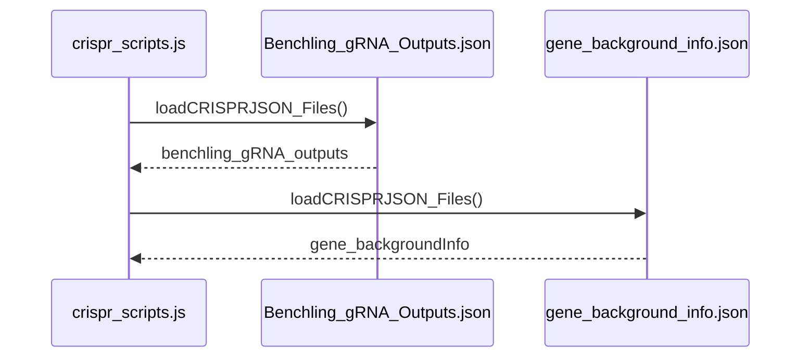
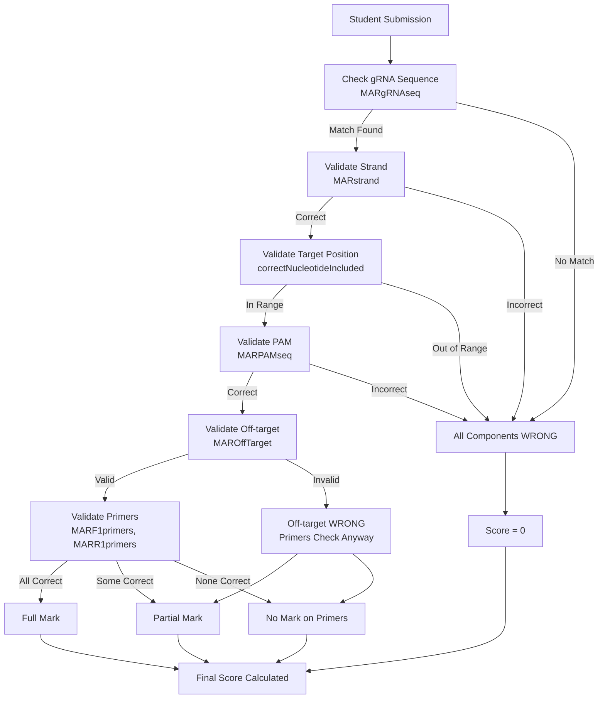
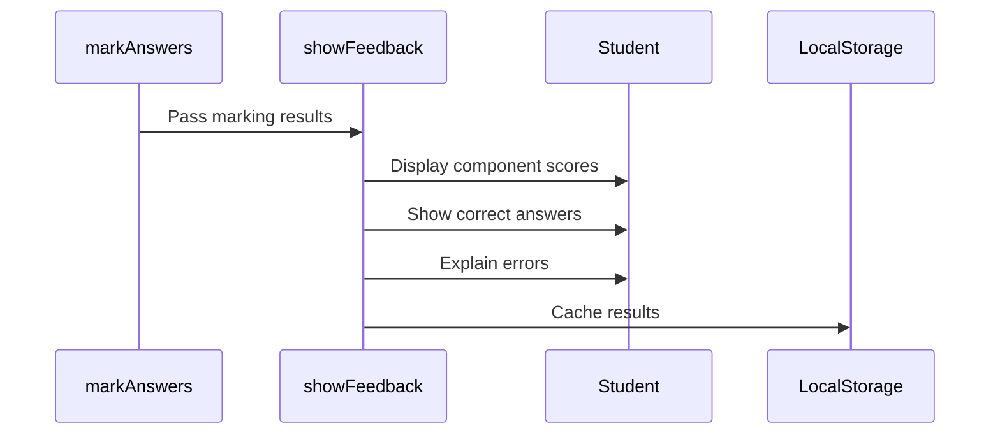

# Marking Algorithm

This document explains how gRNA sequences and primers are validated and scored in SciGrade.

## Overview

The marking system validates student submissions across five key components:

1. **gRNA Sequence** - Must match a reference sequence
2. **PAM Sequence** - Must match the PAM of the validated gRNA
3. **Strand** - Must indicate correct strand (sense/antisense)
4. **Off-target Score** - Must meet an "optimal" threshold
5. **F1 & R1 Primers** - Must be correctly designed with proper complementarity

## Core Marking Function

The main marking logic is in [core/scripts/crispr_scripts.js](../../core/scripts/crispr_scripts.js):

```javascript
function markAnswers() {
	// Marking is based on checkAnswers() results
	// Returns a combined score from individual component checks
}
```

## Step-by-Step Validation

### Step 1: Load Reference Data



Both reference files are fetched asynchronously during initialization.

### Step 2: gRNA Sequence Validation

When a student submits their answer, [checkAnswers()](../../core/scripts/crispr_scripts.js#L232) searches for matching gRNA sequences:

```javascript
const inputtedSeq = document.getElementById("sequence_input").value.trim();
for (const answer of benchling_gRNA_outputs.gene_list[current_gene]) {
	if (answer.Sequence === inputtedSeq) {
		possible_comparable_answers.push(answer);
	}
}
```

**Matching Criteria:**

- Input sequence must **exactly match** one or more reference sequences (case-insensitive after trim)
- If no match found, all components are marked incorrect
- If matches found, continue to step 3

### Step 3: Nucleotide Target Validation

For each possible matching sequence, verify the target nucleotide is within the gRNA binding range:

```javascript
const correctNucleotidePosition = gene_backgroundInfo.gene_list[current_gene]["Target position"] - 1;

if (possibleAnswer.Strand === 1) {
	// Sense strand: check if target is within gRNA range
	const nucleotideIncludedRange_top = possibleAnswer.Position - 1 - 1 + 3;
	const nucleotideIncludedRange_bot = possibleAnswer.Position - 1 - 17;

	if (
		correctNucleotidePosition >= nucleotideIncludedRange_bot &&
		correctNucleotidePosition <= nucleotideIncludedRange_top
	) {
		correctNucleotideIncluded = true;
	}
} else if (possibleAnswer.Strand === -1) {
	// Antisense strand: check if target is within gRNA range
	const nucleotideIncludedRange_top = possibleAnswer.Position - 1 + 17;
	const nucleotideIncludedRange_bot = possibleAnswer.Position - 1 - 3;

	if (
		correctNucleotidePosition >= nucleotideIncludedRange_bot &&
		correctNucleotidePosition <= nucleotideIncludedRange_top
	) {
		correctNucleotideIncluded = true;
	}
}
```

**Why This Matters:**

- The gRNA must include the target mutation
- 20bp gRNA covers ~17-20 nucleotides depending on strand
- If target is outside this range, the gRNA cannot affect the mutation

### Step 4: Strand Validation

Check if the student selected the correct strand:

```javascript
if (possibleAnswer.Strand === 1) {
	if (document.getElementById("strand_input").value === "Sense (+)") {
		MARstrand = true;
	}
} else if (possibleAnswer.Strand === -1) {
	if (document.getElementById("strand_input").value === "Antisense (-)") {
		MARstrand = true;
	}
}
```

**Reference:**

- Strand `1` = Sense (+) strand
- Strand `-1` = Antisense (-) strand

### Step 5: PAM Sequence Validation

PAM location depends on strand orientation:

```javascript
if (possibleAnswer.Strand === 1) {
	pamFirst = possibleAnswer.Position - 1 + 2;
	pamSecond = possibleAnswer.Position - 1 + 4;
} else if (possibleAnswer.Strand === -1) {
	pamFirst = possibleAnswer.Position - 1 - 2;
	pamSecond = possibleAnswer.Position - 1 - 4;
}

// Extract PAM from sequence
const pamExtracted = gene_backgroundInfo.gene_list[current_gene].Sequence.slice(pamFirst, pamSecond + 1);

// Check if student input matches
if (document.getElementById("pam_input").value === possibleAnswer.PAM) {
	MARPAMseq = true;
}
```

### Step 6: Off-Target Score Validation

```javascript
function checkOffTarget(score) {
	// Check if off-target score meets minimum threshold
	// Threshold depends on marking mode settings
}
```

**Scoring Modes:**

The off-target score is validated against an "optimal" value:

1. **Optimal Mode** (default):

    ```
    Min_optimal = Max_range - (Max_range * 0.2)
    ```

    Where `Max_range` is the highest feasible off-target score for the gene.

2. **Custom Mode**:
    - TA/Admin sets a custom optimal value between 0.01 and 100
    - Student score must exceed this custom value

**Pass Criteria:**

- Score > optimal value = Full credit (mark as above optimal)
- Score > 35 but ≤ optimal = Partial credit (above minimum)
- Score > 0 but ≤ 35 = Minimal credit (technically feasible)

### Step 7: Primer Validation

#### F1 Primer Check

```javascript
function checkF1Primers(seq) {
	// F1 (forward) primer structure
	// Typically includes promoter sequence + T7 binding + gRNA start
	// Student input should contain required segments
}
```

#### R1 Primer Check

```javascript
function checkR1Primers(seq) {
	// R1 (reverse) primer must be reverse complement of gRNA
	const complement = createComplementarySeq(seq);
	// Check if sequence contains complement within correct region
}
```

**Complementarity Function:**

```javascript
function createComplementarySeq(seq) {
	// A ↔ T, G ↔ C, then reverse the string
	let complement = "";
	for (const base of seq) {
		if (base === "A") complement += "T";
		else if (base === "T") complement += "A";
		else if (base === "G") complement += "C";
		else if (base === "C") complement += "G";
	}
	return complement.split("").reverse().join("");
}
```

## Scoring Logic



## Global State Variables

All validation results stored in global variables (in [crispr_scripts.js](../../core/scripts/crispr_scripts.js)):

```javascript
let MARgRNAseq = false; // gRNA sequence match
let MARgRNAseq_degree = 0; // 0: wrong, 1: correct, 2: partial <20bp, 3: correct <30bp
let MARPAMseq = false; // PAM sequence match
let MARCutPos = false; // Cut position correctness
let MARstrand = false; // Strand selection correctness
let MAROffTarget = false; // Off-target score validity
let MAROffTarget_degree = 0; // 0: wrong, 1: >75, 2: >35, 3: only option
let MARF1primers = false; // F1 primer correctness
let MARR1primers = false; // R1 primer correctness
```

## Feedback System

After marking, student feedback is displayed via [showFeedback()](../../core/scripts/crispr_scripts.js#L602):



**Feedback Includes:**

- Component-by-component results (✓ or ✗)
- Correct gRNA sequence if wrong
- Correct PAM if wrong
- Optimal off-target threshold
- Primer design suggestions

## Customization

### Adjusting Off-target Threshold

In account management modal (opened via [openAccountManagement()](../../core/scripts/crispr_scripts.js#L853)):

1. Select "Optimal" mode:
    - Automatically calculates: `Max - (Max * 0.2)`
    - Applies to all students in class

2. Select "Custom" mode:
    - Enter specific value (0.01 - 100)
    - Allows flexible grading standards

### Adding Custom Marking Rules

To modify marking logic:

1. Edit `checkAnswers()` to add validation steps
2. Update `markAnswers()` to adjust scoring weights
3. Update feedback in `showFeedback()` to explain new criteria
4. Add corresponding tests in [crispr_scripts.test.js](../../core/scripts/crispr_scripts.test.js)

## Reference Data Format

Ensure reference data in [Benchling_gRNA_Outputs.json](../../core/data/Benchling_gRNA_Outputs.json) follows:

```json
{
	"gene_list": {
		"GENENAME": [
			{
				"Position": 123,
				"Strand": 1,
				"Sequence": "ACGTACGTACGTACGTACGT",
				"PAM": "NGG",
				"Specificity Score": 45.2,
				"Efficiency Score": 78.5
			}
		]
	}
}
```

**Field Descriptions:**

- `Position` - Start position of gRNA on template strand
- `Strand` - `1` = sense, `-1` = antisense
- `Sequence` - 20bp gRNA sequence (5' to 3')
- `PAM` - Protospacer adjacent motif (3 bases)
- `Specificity Score` - Off-target score (0-100)
- `Efficiency Score` - On-target score (0-100)

## Testing

Unit tests for marking logic: [crispr_scripts.test.js](../../core/scripts/crispr_scripts.test.js)

Run tests:

```bash
npm run test:jest
```
