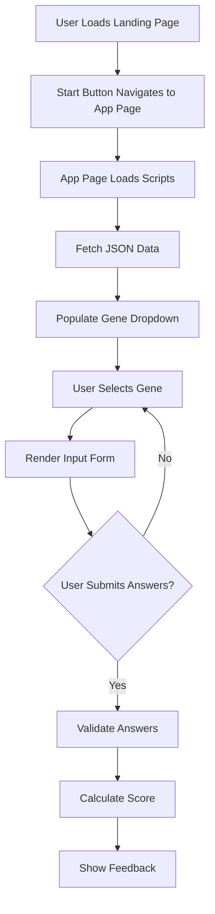
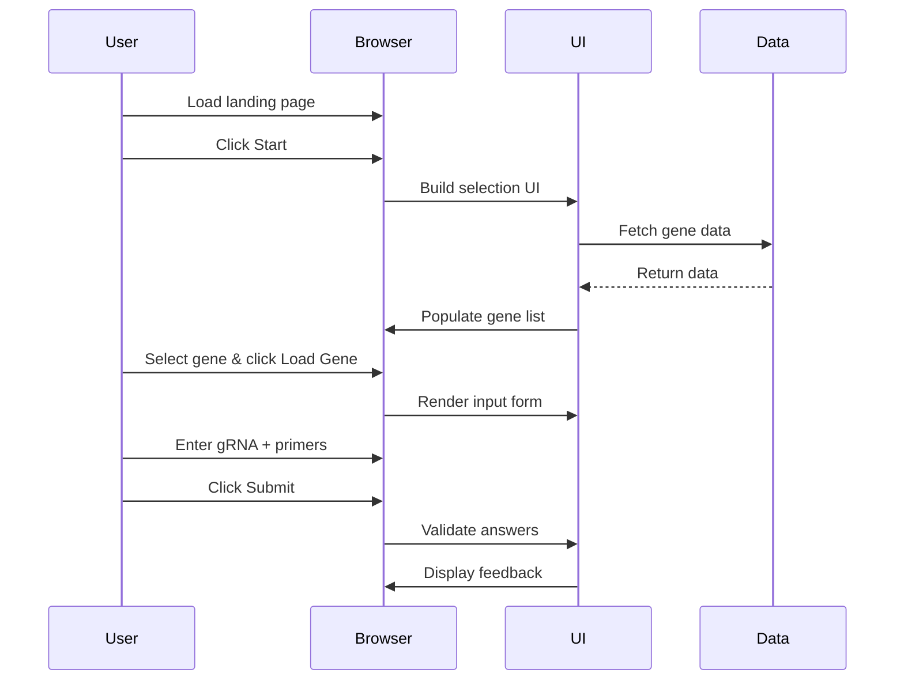

# SciGrade Documentation

Welcome to the SciGrade documentation. This directory contains comprehensive guides for understanding, using, and developing SciGrade.

## Overview

[SciGrade](https://scigrade.com/) is a client-side web application that allows students and educators to practice and receive feedback on guide RNA (gRNA) design and F1/R1 primer entry for Clustered Regularly Interspaced Short Palindromic Repeats (CRISPR)-based workflows.

The landing page is [index.html](../index.html), which links to the application runtime page [core/systemrun.html](../core/systemrun.html). The runtime page loads [core/scripts/runtime.js](../core/scripts/runtime.js) and [core/scripts/crispr_scripts.js](../core/scripts/crispr_scripts.js) and starts the UI flow on page load.

## Documentation Structure

- **[Getting Started](guides/setup.md)** - Installation, local development setup, and basic usage
- **[Architecture](architecture/index.md)** - System design, data flow, and component structure
- **[Marking Algorithm](guides/marking-algorithm.md)** - How gRNA and primer answers are validated
- **[Data Structures](guides/data-structures.md)** - JSON data formats and storage
- **[API Reference](api/index.md)** - Core functions and module documentation

## Application Flow

The flow below reflects the landing page in [index.html](../index.html) and the runtime UI/data flow in [core/scripts/runtime.js](../core/scripts/runtime.js) and [core/scripts/crispr_scripts.js](../core/scripts/crispr_scripts.js).

## User Interaction Sequence

This sequence follows the runtime flow implemented in [core/scripts/runtime.js](../core/scripts/runtime.js) and [core/scripts/crispr_scripts.js](../core/scripts/crispr_scripts.js).

## Key Concepts

### Genes

SciGrade uses the gene list defined in [core/data/Background_info/gene_background_info.json](../core/data/Background_info/gene_background_info.json):

- **eBFP** - Enhanced blue fluorescence protein
- **ACTN3** - Actinin alpha 3
- **HBB** - Hemoglobin beta (sickle cell anemia)
- **CCR5** - C-C motif chemokine receptor 5 (HIV resistance)
- **APOE** - Apolipoprotein E (Alzheimer's risk)

### Core Features

#### Practice Flow

- The runtime page initializes the practice flow on page load
- Feedback is generated after submission by [core/scripts/crispr_scripts.js](../core/scripts/crispr_scripts.js)

The [CHANGELOG.md](../CHANGELOG.md) records the deprecation of online account features.

## Technology Stack

- **Frontend**: Vanilla JavaScript with jQuery and Bootstrap loaded from [core/scripts/APIandLibraries/](../core/scripts/APIandLibraries/)
- **Data**: Client-side JSON data files loaded by [core/scripts/crispr_scripts.js](../core/scripts/crispr_scripts.js)
- **Build Tools**: Jest, Playwright, ESLint, Prettier, and esbuild defined in [package.json](../package.json)
- **Service Worker**: Workbox configuration in [workbox-config.cjs](../workbox-config.cjs) and generated runtime in [core/scripts/serviceWorker/sw.js](../core/scripts/serviceWorker/sw.js)

## Development

For contributions and modifications:

1. Review [CONTRIBUTING.md](../CONTRIBUTING.md)
2. Read [EDIT.MD](../EDIT.MD) for modification guidance
3. Follow [guides/setup.md](guides/setup.md) for local development
4. Run `npm run validate` from [package.json](../package.json)

## License

SciGrade is licensed under [GPL-3.0](../LICENSE.md)
