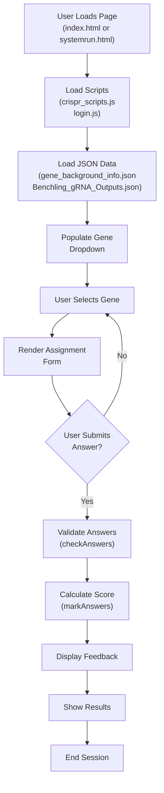
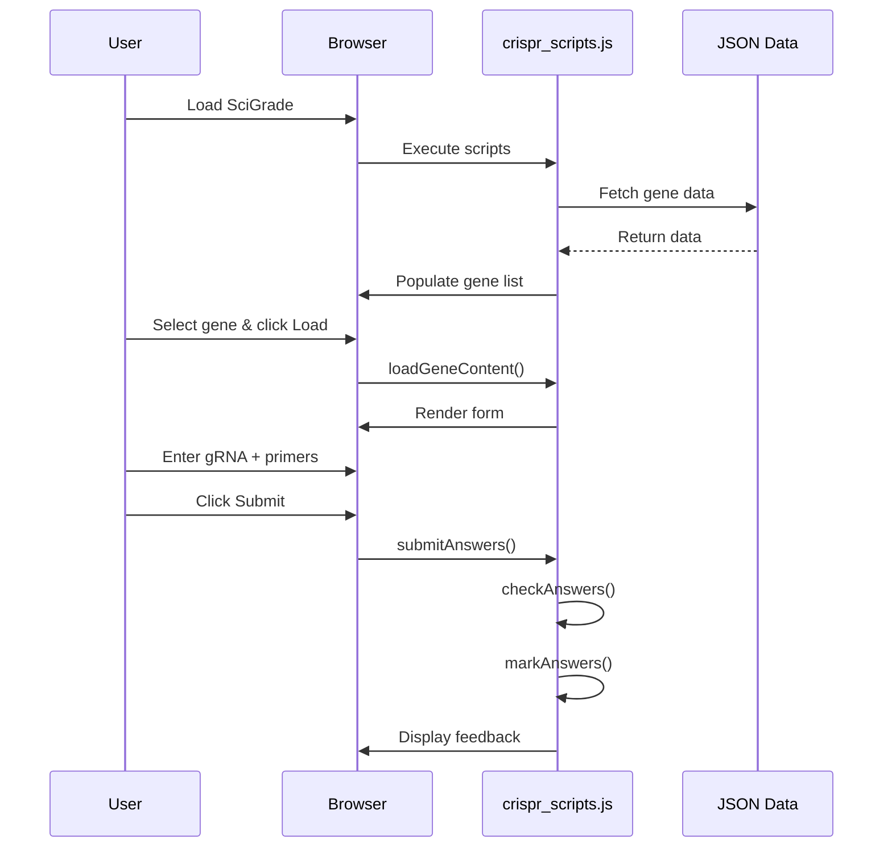

# SciGrade Documentation

Welcome to the SciGrade documentation. This directory contains comprehensive guides for understanding, using, and developing SciGrade.

## Overview

[SciGrade](https://scigrade.com/) is an online web-tool that allows students and educators to practice and receive feedback on gRNA (guide RNA) design and F1/R1 primer generation for CRISPR-based genetic modifications.

## Documentation Structure

- **[Getting Started](guides/setup.md)** - Installation, local development setup, and basic usage
- **[Architecture](architecture/index.md)** - System design, data flow, and component structure
- **[Marking Algorithm](guides/marking-algorithm.md)** - How gRNA and primer answers are validated
- **[Data Structures](guides/data-structures.md)** - JSON data formats and storage
- **[API Reference](api/index.md)** - Core functions and module documentation

## Application Flow

## User Interaction Sequence

## Key Concepts

### Genes

SciGrade supports multiple target genes for practice and assignment work:

- **eBFP** - Enhanced blue fluorescence protein (HEK293FT cells)
- **ACTN3** - Actinin alpha 3 (elite athletic performance mutation)
- **HBB** - Hemoglobin beta (sickle cell anemia)
- **CCR5** - C-C motif chemokine receptor 5 (HIV resistance)
- **ANKK1** - Ankyrin repeat and kinase domain-containing protein 1
- **APOE** - Apolipoprotein E (Alzheimer's risk)

### Core Features

#### Practice Mode

- Students can freely experiment with gRNA and primer design
- Immediate feedback on submission
- No login required (by default)

#### Assignment Mode

- Locally deployed version allows instructor use for grading
- Submission and result tracking
- No online account system required

## Technology Stack

- **Frontend**: Vanilla JavaScript, jQuery, Bootstrap
- **Data**: Client-side JSON data files
- **Build Tools**: Jest, Playwright, ESLint, Prettier
- **Service Worker**: Workbox for offline caching

## Development

For contributions and modifications:

1. Review [CONTRIBUTING.md](../CONTRIBUTING.md)
2. Read [EDIT.MD](../EDIT.MD) for modification guidance
3. Follow [setup.md](guides/setup.md) for local development
4. Ensure all tests pass with `npm run validate`

## License

SciGrade is licensed under [GPL-3.0](../LICENSE.md)

## Project Status

This project is in **maintenance mode**. Only critical bug fixes and security updates will be addressed.
